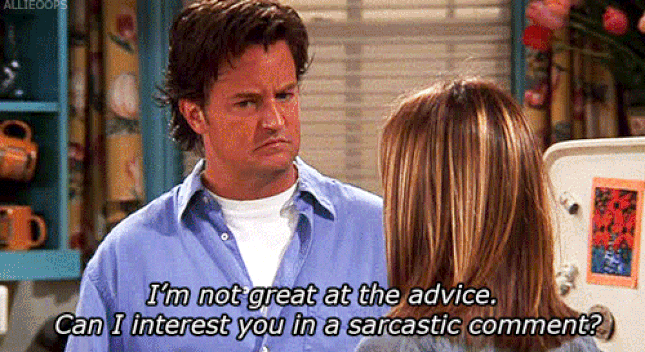
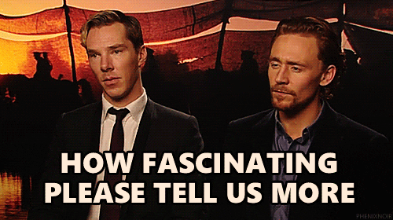

# Sarcasm Detector

## Introduction

Sarcasm is defined to be "the use of remarks that clearly mean the opposite of what they say, made in order to hurt someone's feelings or to criticize something in a humorous way" by The Cambridge Dictionary. Used for a varitey of purposes in the media, sarcasm can portray strong opinions and extreme perspectives of current events to provide comic relief and culturally-relevant dialogue.

The dataset utilized in this project derives news headlines from two sources: (1) TheOnion for sarcastic articles, and (2) HuffPost for non-sarcastic articles. Our goal will be to create a classifier that can effectively differentiate between sarcastic and nonsarcastic headlines.

This project and the subsequent models developed provide relevant information about how to distinguish between real news and fake news in a world increasingly characterized by mass amounts of news every second of every day. As our society becomes more and more polarized and partisan in our efforts to enact policies and reach solutions for the many issues that plague our world, it becomes increasingly necessary to sort out fact from fiction. Thus, further work of importance may include expanding these models and data exploration in attempts to determine the level of objectivity and bias in a given headline, somewhere on a scale from perfectly factual to perfectly sarcastic.

## Objectives

Our primary objective in the following project will be to develop deep neural networks and other classifiers that provide accurate classification models for determining whether a given headline is sarcastic or nonsarcastic. Furthermore, we will explore characteristics of our headline data overall, as well as in the context of sarcastic and non-sarcastic subsets.

Additional sections are labeled accordingly and include the following research questions:

* What proportion of articles are sarcastic? Non-sarcastic?
* How many total words are in our overall dataset? Total sarcastic words? Total non-sarcastic words?
* How many of these words are unique within our dataset? Unique sarcastic words? Unique non-sarcastic words?
* Which words are most common in headlines (including stopwords)? Most common in sarcastic headlines? Most common in non-sarcastic headlines?
* Which words, excluding stopwords, are most common in our three groups of headlines?
* With stopwords removed, which bigrams and trigrams are most populous in our headlines?
* How do these measures reflect cultural trends relevant to the time period?
* Using the Word2Vec vectorizer, how do initial classification models perform in differentiating between sarcastic and non-sarcastic headlines?
* Which types of RNNs can perform better than these intial models?
* What future work is possible based upon our findings in this project?

## Process

Across the scope of the project, we touch upon various components of our data science process, depending on the research question at hand. However, the overall project from start to finish adheres to the OSEMN framework:

1. Obtain
2. Scrub
3. Explore
4. Model
5. Interpret

## Findings

Within our exploration of over 26,000 article headlines, we discovered the following:
* Our dataset was comprised of 43.9% sarcastic articles and 56.1% non-sarcastic articles.
* Across all headlines, there were over 280,000 tokens and over 29,000 unique tokens.
* Trump, Obama, and Clinton were the most mentioned people across all article headlines.
* References to men were 3x as likely as references to women.
* Climate change, health care, sexual assault, and mental health were the top social issues.
* Most of the sarcastic bigrams represent a vague generality that allows the headlines to be more relateable and applicable to a wide variety of people.
* New York and North Korea are the most frequently mentioned places.
* Donald Trump appears in nearly all the top lists of words, bigrams, and trigrams.

When modeling the data, we found:
* Baseline models utilizing Word2Vec vectorization and word embeddings performed well, with over 70% accuracy.
* LSTM and GRU models using RNN structure performed poorly, with under 50% accuracy.
* Our bidirectional sequence model performed the best, with 82.3% accuracy for the test set, after training the model on the train and validation sets.

## Future Work

Future work within this field may involve training models that are able to differentiate between real news and fake news. While the validity and objectivity of news remains a matter of opinion, no matter which way you lean, our media has become more and more subjective and influenced by bias, whether from those biases of the brodcasting network or the ways in which technology employs as usage data to feed us content that further supports our preexisting beliefs. These practices further fortify the political barriers that divide our nation, and thus, measures that aide in the transparency and true objectivity of the state of our government and society will enable us to properly tackle the issues that we face in the 21st century. While our project here scratches the surface of language processing and NLP data management, the possibilities for future work within this arena are endless.

<iframe src="https://giphy.com/embed/7A4iGSv5ncnLxUfGjZ" width="480" height="270" frameBorder="0" class="giphy-embed" allowFullScreen></iframe>
<a href="https://giphy.com/gifs/clapping-sarcastic-pelosi-7A4iGSv5ncnLxUfGjZ">via GIPHY</a>
